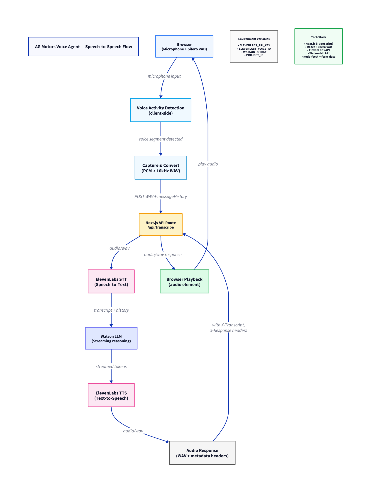

# Voice Agent for AG Motors (TypeScript)

---

## 1️⃣ Project Domain (Business View)

This repository contains the Voice Agent for AG Motors — a web-based, TypeScript voice assistant used to handle spoken interactions for showroom kiosks, customer support, and in-vehicle demos. The agent listens for speech, transcribes user input (Arabic-focused), reasons with a streamed LLM, and responds with synthesized audio.

Key value propositions:
- Real-time spoken interactions for customers and staff.
- Arabic-first STT/TTS and conversational flow.
- Lightweight client-side voice activity detection to reduce cloud calls and latency.

---

## 2️⃣ Project Workflow (Technical View)

High-level flow:

- Browser microphone -> Silero VAD (client) detects voice segments.
- Captured PCM -> client converts to WAV and uploads to Next.js API route `/api/transcribe`.
- Server sends audio to ElevenLabs Speech-to-Text (STT) -> receives transcript.
- Transcript and message history are streamed to Watson LLM (server-side streaming).
- Watson LLM streaming output is gathered and converted to audio via ElevenLabs Text-to-Speech (TTS).
- Server returns a WAV response (audio/wav) and headers with transcript/response metadata; client plays the returned audio.


---

## 3️⃣ Inputs vs Outputs

Inputs:
- Microphone audio (captured client-side, converted to 16 kHz WAV)
- `messageHistory` (JSON array of prior chat messages)
- Environment variables / API keys (`ELEVENLABS_API_KEY`, `WATSON_APIKEY`, `PROJECT_ID`, `ELEVENLABS_VOICE_ID`)

Outputs:
- `audio/wav` response (TTS audio) returned from `/api/transcribe`
- Response headers: `X-Transcript` (transcribed text) and `X-Response` (LLM text)
- Client-side UI messages state (`messages` array) updated with user + assistant content

---

## 4️⃣ Used Packages / Purpose

| Package / Technology | Purpose |
| -------------------- | ------- |
| Next.js (TypeScript) | Web framework, API routes, server-side runtime |
| React (client)       | UI and SpeechDetector component |
| Silero VAD (web VAD) | Client-side voice activity detection to capture segments |
| ElevenLabs API       | Speech-to-text (STT) and Text-to-speech (TTS) |
| Watson ML API        | Streaming LLM for reasoning and response generation |
| node-fetch           | Server-side HTTP requests to external APIs |
| form-data            | Multipart uploads to STT endpoints |

Files of interest:
- `src/app/api/transcribe/route.ts` — main API route handling STT/LLM/TTS flow
- `src/app/api/transcribe/services/elevenlabs_stt.ts` — ElevenLabs STT helper
- `src/app/api/transcribe/services/elevenlabs_tts.ts` — ElevenLabs TTS helper
- `src/app/api/transcribe/services/watson_llm.ts` — Watson streaming wrapper
- `src/app/components/SpeechDetector.tsx` — client-side VAD, audio capture, upload and playback

---

## 5️⃣ Current Status

- Implemented: client-side VAD, audio capture/convert-to-WAV, Next.js API route, STT via ElevenLabs, streaming LLM via Watson, TTS via ElevenLabs, playback handling on client.
- No formal test suite included in the repository (no automated tests referenced).
- Known considerations / issues:
  - Requires valid API keys to function (ElevenLabs & IBM Watson). See `.env.local` in attachments.
  - Network and streaming reliability may vary depending on Watson/ElevenLabs availability.
  - Client-side audio handling and sample-rate conversions are implemented in `SpeechDetector.tsx` — check browser compatibility.

---

## 6️⃣ Next Steps

- Add robust error handling and exponential backoff for external API calls.
- Add automated tests for the API route and client audio conversion utilities.
- Add streaming playback optimization to pipe Watson tokens to TTS earlier (reduce perceived latency).
- Add CI checks for environment variable presence and build validation.

---

## 7️⃣ Steps to Run Locally

Prerequisites:
- Node.js 18+ recommended
- Valid API keys: `ELEVENLABS_API_KEY`, `ELEVENLABS_VOICE_ID`, `WATSON_APIKEY`, `PROJECT_ID` (place them in `.env.local`)

Install and run:

```bash
npm install
npm run dev
```

Example `.env.local` variables (do NOT commit your real keys):

```
ELEVENLABS_API_KEY=your-elevenlabs-key
ELEVENLABS_VOICE_ID=your-voice-id
WATSON_APIKEY=your-watson-apikey
PROJECT_ID=your-watson-project-id
```

Client quick test flow:
- Open the app in the browser when dev server is running.
- Allow microphone access. The `SpeechDetector` UI will initialize Silero VAD.
- When speaking, the client will capture audio, send to `/api/transcribe`, and play back the assistant's response.

---

## Contact / Maintainers

- Project: Voice Agent for AG Motors
- Primary files for changes: see "Files of interest" above.

---

_Generated from repository source files: `SpeechDetector.tsx`, `route.ts`, and service helpers (ElevenLabs + Watson)._
